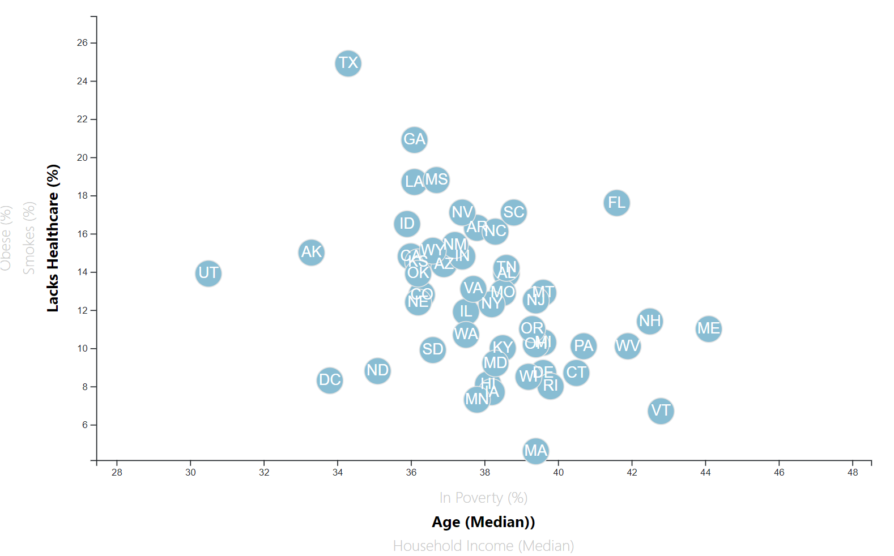

D3 Homework
1. In this part, we will represent the data in scatter plot chart using D3.select.
2. Initially, we define the svg location and size in the browser.

3. Next step, we will set up the scale for x and y axes.

4. Since we have options to choose the axis on scatter plot, we have to define functions that change axes' scale when the audience clicks on the options of axis.

5. When the user choose an option on axis, the circles will move to new scale and the texts are too.

6. The tooltip will change the texts according to their axes.

7. When the data is read into using  d3.csv, we will define the scatter plot with left axis and bottom axis, create the circles and texts, adjust the features in order for the axes to active and inactive on the chart.

8. Then we will create two event listeners for x and y axes when either of them is clicked on.

9. The final appearance on the browser with the default axes would be such as below and after that when other axes are choosen.

